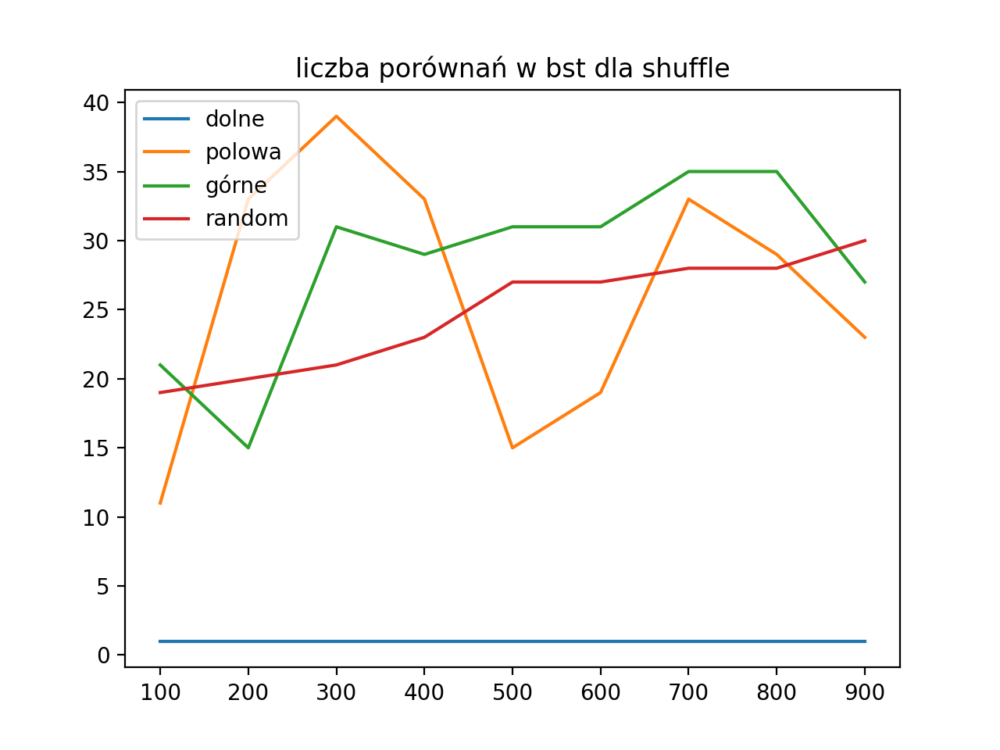

# Lista 4 - Algorytmy i Struktury danych

## zadanie 2 - wykresy porównań

w trzech drzewach:
- bst
- rbt
- splay

w trzech różnych plikach:
- `aspell_wordlist.txt`
- dla potasowanego pliku `aspell_wordlist.txt`
- `lotr.txt`

### Liczba porównań w bst

#### Porównania w drzewie posortowanym

#### Porównania w drzewie potasowanym

#### Porównania w drzewie z możliwymi powtórzeniami

### Liczba porównań w rbt

#### Porównania w drzewie posortowanym

#### Porównania w drzewie potasowanym

#### Porównania w drzewie z możliwymi powtórzeniami

### Liczba porównań w splay

#### Porównania w drzewie posortowanym

#### Porównania w drzewie potasowanym

#### Porównania w drzewie z możliwymi powtórzeniami

